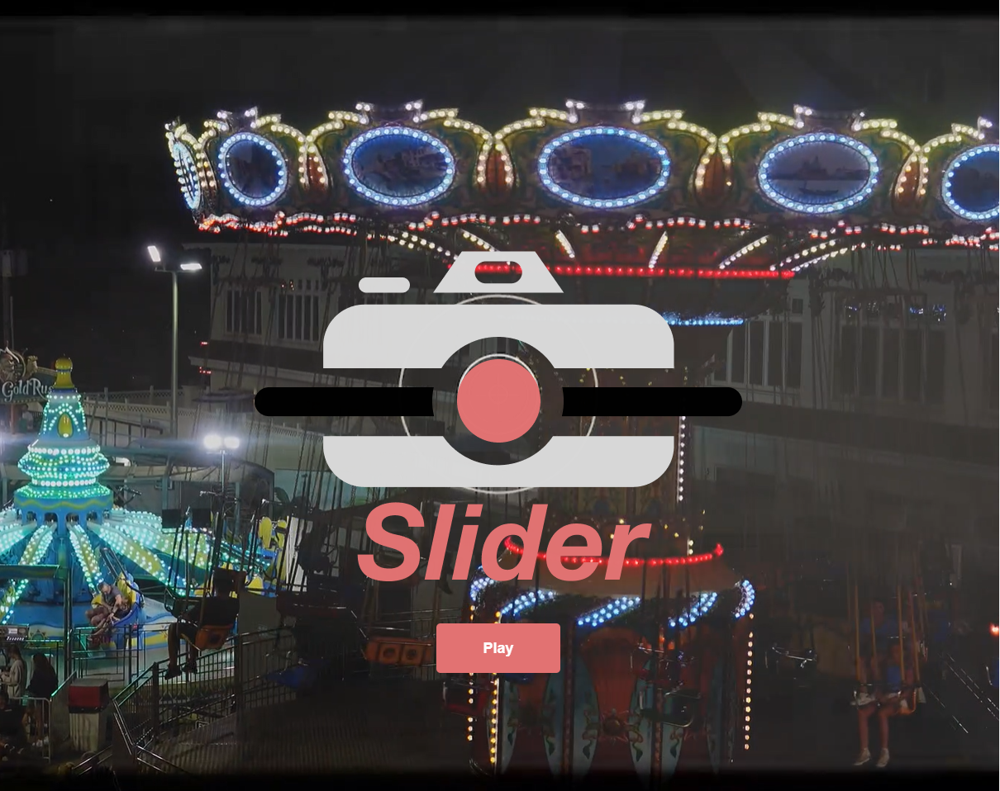
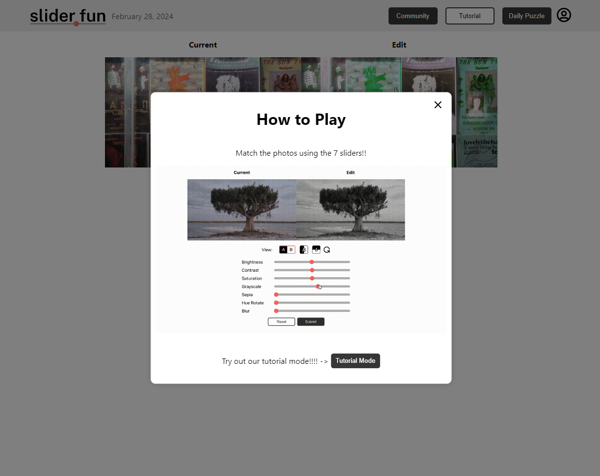
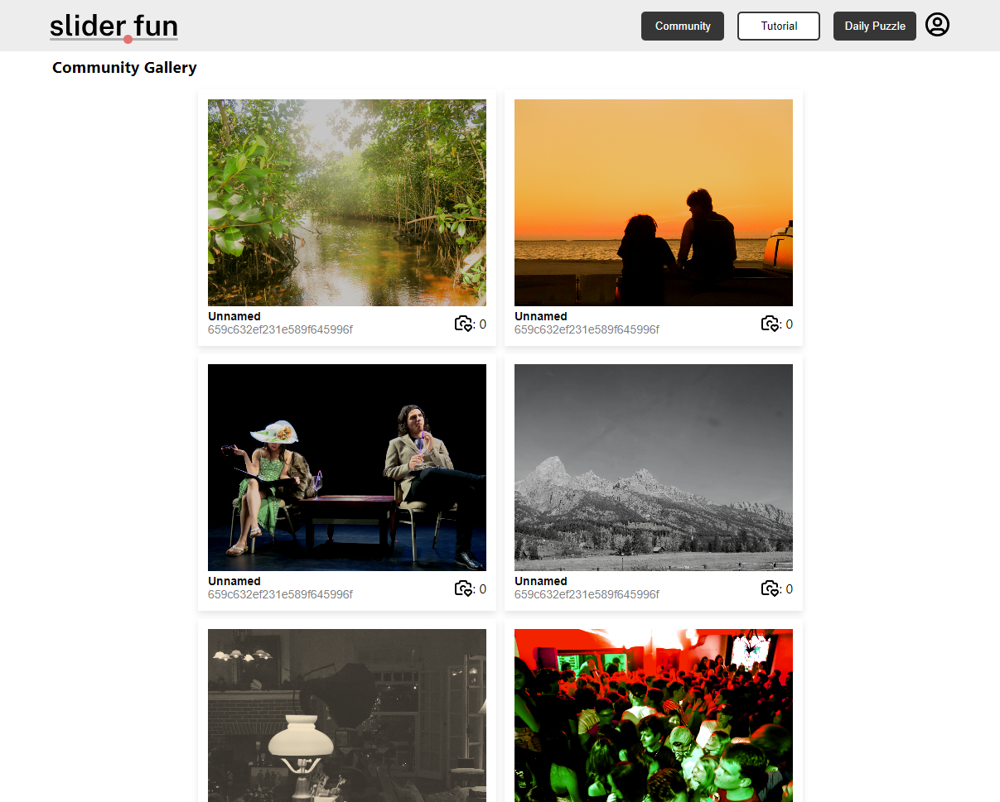

# Slider.Fun

Our aim for this project is to help players learn photo editing skill in a fun way. We will provide the player with an edited photo and give them options to change things such as contrast, brightness, etc to get the original image as close as possible to the eddited image provided. 

## Architecture

- Front-end framework: React
- Code organization: [front-end repo](https://github.com/dartmouth-cs98-23f/slider.fun-frontend), [back-end repo](https://github.com/dartmouth-cs98-23f/slider.fun-backend)

## Setup

#### For developer
If setting up the environment for the first time you need to do
`npm i` to download all necessary React dependencies. and then do `npm run start`
 
## Deployment

This project will be hosted using AWS and it will be synced with the github repo. It's not currently set up yet but will most likely be using the command  `npm run deploy`

## Authors

Kashan Mahmood, Zhoucai Ni, Ethan Gearey, Russell Chai, Johan Cruz Hernandez

## Acknowledgments

Thank you to Professor Tim Tregubov and Professor Natalie Svoboda!